## Vertex Buffer Object(VBO)

```c++
GLuint vbo = 0;
GL_CALL(glGenBuffers(1, &vbo));

// 销毁1个VBO
GL_CALL(glDeleteBuffers(1, &vbo));

// 创建n个VBO
GLuint vboArr[] = {0, 0, 0};
GL_CALL(glGenBuffers(3, vboArr));

// 销毁n个VBO
GL_CALL(glDeleteBuffers(3, vboArr));
```

### VBO绑定+数据更新

#### VBO的绑定

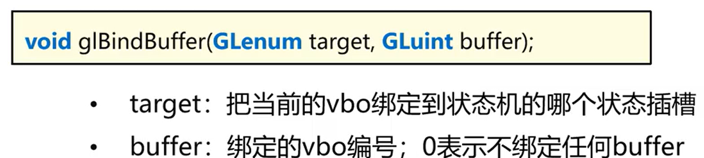


#### VBO填入数据

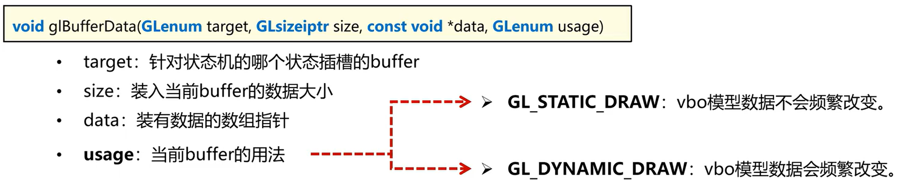


## Vertex Array Object(VAO)

顶点数组对象，用于存储一个Mesh网格所有的顶点描述信息。

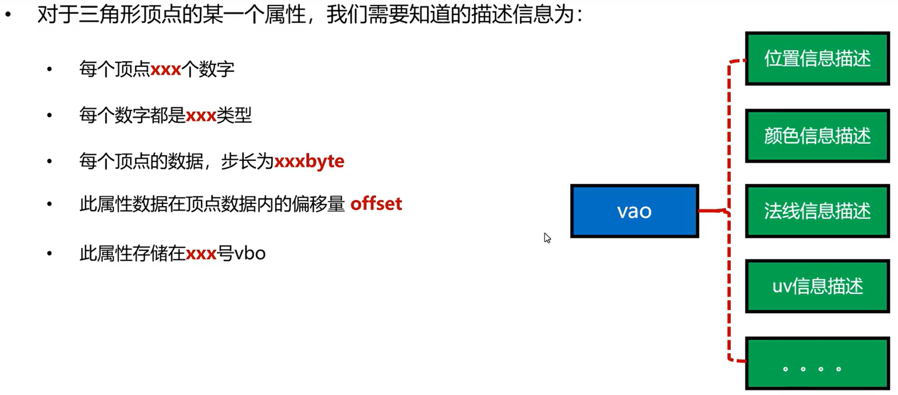

### VAO创建与删除

#### VAO的创建


#### VAO的删除

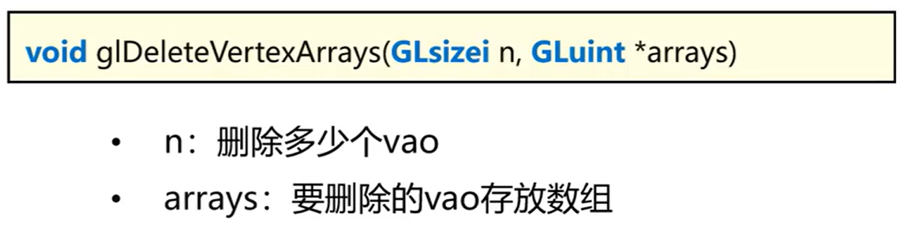


#### VAO的绑定

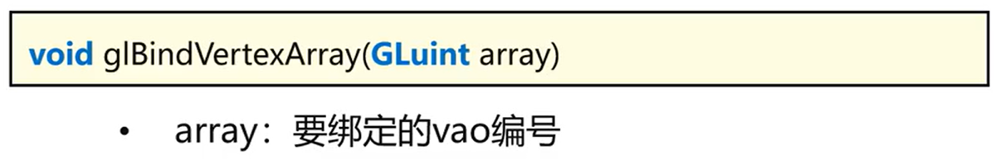


#### VAO加入描述属性

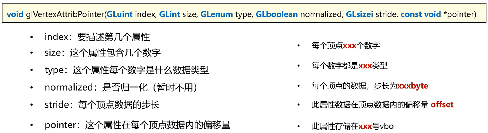


#### 数据分开存放并绑定vao

```c++
void prepareSingleBuffer() {
    // 准备positions,colors数据
    float positions[] = {
            -0.5f, -0.5f, 0.0f,
            0.5f, -0.5f, 0.0f,
            0.0f, 0.5f, 0.0f
    };

    float colors[] = {
            1.0f, 0.0f, 0.0f,
            0.0f, 1.0f, 0.0f,
            0.0f, 0.0f, 1.0f
    };

    // 使用数据生成两个vbo posVbo，colorVbo
    GLuint posVbo, colorVbo;
    glGenBuffers(1, &posVbo);
    glGenBuffers(1, &colorVbo);

    glBindBuffer(GL_ARRAY_BUFFER, posVbo);
    glBufferData(GL_ARRAY_BUFFER, sizeof(positions), positions, GL_STATIC_DRAW);

    glBindBuffer(GL_ARRAY_BUFFER, colorVbo);
    glBufferData(GL_ARRAY_BUFFER, sizeof(colors), colors, GL_STATIC_DRAW);

    // 生成vao并且绑定
    GLuint vao = 0;
    glGenVertexArrays(1, &vao);
    glBindVertexArray(vao);

    // 分别将位置/颜色属性的描述信息加入vao当中
    // 描述位置信息
    glBindBuffer(GL_ARRAY_BUFFER, posVbo);
    glEnableVertexAttribArray(0);
    glVertexAttribPointer(0, 3, GL_FLOAT, GL_FALSE, 3 * sizeof(float), (void*)0);

    // 描述颜色属性
    glBindBuffer(GL_ARRAY_BUFFER, colorVbo);
    glEnableVertexAttribArray(1);
    glVertexAttribPointer(1, 3, GL_FLOAT, GL_FALSE, 3 * sizeof(float), (void*)0);

    glBindVertexArray(0);
}
```


#### 数据交叉存放并绑定vao

```c++
void prepareInterleavedBuffer() {
    // 准备好Interleaved数据（位置+颜色）
    float vertices[] = {
            -0.5f, -0.5f, 0.0f, 1.0f, 0.0f, 0.0f,
            0.5f, -0.5f, 0.0f, 0.0f, 1.0f, 0.0f,
            0.0f, 0.5f, 0.0f, 0.0f, 0.0f, 1.0f
    };

    // 创建唯一的vbo
    GLuint vbo;
    GL_CALL(glGenBuffers(1, &vbo));
    GL_CALL(glBindBuffer(GL_ARRAY_BUFFER, vbo));
    GL_CALL(glBufferData(GL_ARRAY_BUFFER, sizeof(vertices), vertices, GL_STATIC_DRAW));

    // 创建并绑定vao
    GLuint vao = 0;
    glGenVertexArrays(1, &vao);
    glBindVertexArray(vao);

    // 为vao加入位置和颜色的描述信息
    // 位置描述信息
    glBindBuffer(GL_ARRAY_BUFFER, vbo);
    glEnableVertexAttribArray(0);
    glVertexAttribPointer(0, 3, GL_FLOAT, GL_FALSE, 6 * sizeof(float), (void*)0);

    // 颜色描述信息
    glEnableVertexAttribArray(1);
    glVertexAttribPointer(1, 3, GL_FLOAT, GL_FALSE, 6 * sizeof(float), (void*)(3 * sizeof(float)));

    // 扫尾工作，解绑当前vao
    glBindVertexArray(0);
}
```


## Shader

**着色器程序**：一种运行在GPU端的类C语言，用于处理顶点数据以及决定像素片元最终着色

Shader对三角形数据的处理，分为顶点处理和片元处理，分别称为VertexShader和FragmentShader


### GLSL语言（Graphic Library Shader Language）

着色器是使用一种叫GLSL的leiC语言写成的。GLSL是为图形计算量身定制的，它包含一些针对向量和矩阵操作的有用特性。

#### 特点：

- GLSL程序本质是一种将输入转化为输出的程序
- GLSL程序是一种非常独立的程序，彼此之间无法通信，只能通过输入输出相互承接


#### 数据类型

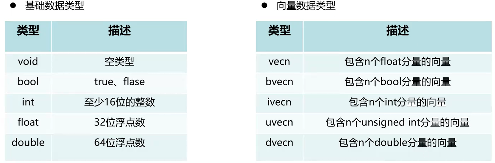


#### 向量使用方式

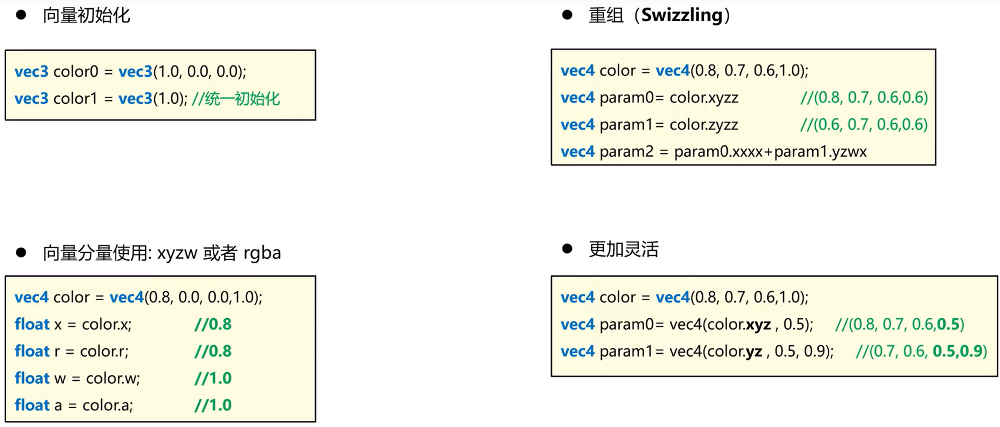


### Shader变量分类

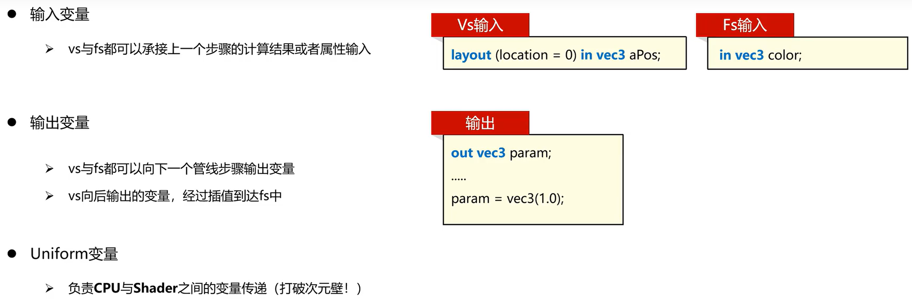


### Shader属性变量信息获取

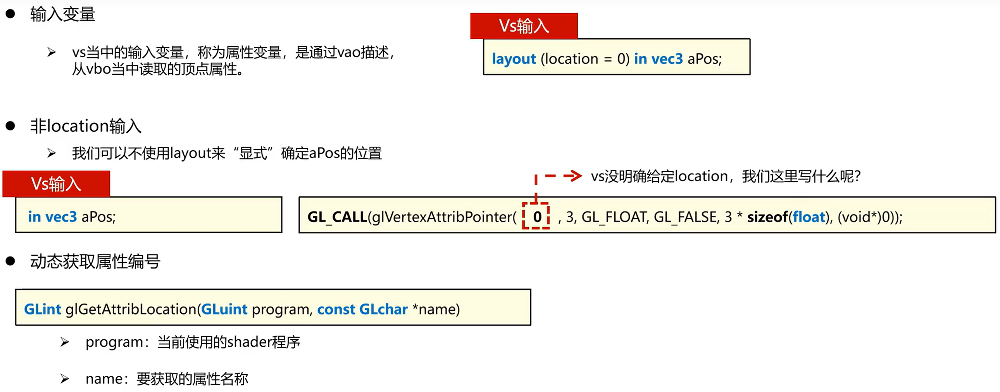

```c++
// 动态获取位置
    GLuint posLocation = glGetAttribLocation(shader->getProgram(), "aPos");
    GLuint colorLocation = glGetAttribLocation(shader->getProgram(), "aColor");

    // 4.VAO创建
    GLuint vao = 0;
    glGenVertexArrays(1, &vao);
    glBindVertexArray(vao);

    // 5.绑定vbo、ebo，加入属性描述信息
    // 加入位置属性描述信息
    glBindBuffer(GL_ARRAY_BUFFER, posVbo);
    glEnableVertexAttribArray(posLocation);
    glVertexAttribPointer(posLocation, 3, GL_FLOAT, GL_FALSE, sizeof(float) * 3, (void*)0);

    // 加入颜色属性描述信息
    glBindBuffer(GL_ARRAY_BUFFER, colorVbo);
    glEnableVertexAttribArray(colorLocation);
    glVertexAttribPointer(colorLocation, 3, GL_FLOAT, GL_FALSE, sizeof(float) * 3, (void*)0);
```


### Uniform变量

被当前Shader运行的所有运算单元共享的变量，称为Uniform变量。

```c++
// 1.通过名称拿到Uniform变量的位置Location
GLint location = GL_CALL(glGetUniformLocation(mProgram, name.c_str()));
// 2.通过Location更新Uniform变量的值
GL_CALL(glUniform1f(location, value));
```


### Vertex Shader

```glsl
#version 460 core
layout (location = 0) in vec3 aPos；
// in:关键字，表示这是一个输入变量
// vec3：表示这是一个三位向量（xyz）
// aPos：这是自定义的变量名称

void main() {
	gl_Position = vec4(aPos.x, aPos.y, aPos.z, 1.0);
}
```


### Fragment Shader

```glsl
#version 460 core
out vec4 FragColor;
// out：表示输出
// vec4：表示输出的是四维向量（rgba）
// FragColor：表示最终输出的变量，名字是自己起的

void main() {
	FragColor = vec4(1.0f, 0.5f, 0.2f, 1.0f);
}
```


### Shader的编译

Shader作为GPU端运行的程序，也需要被编译+链接，成为一款可运行的程序。


#### 创建Shader

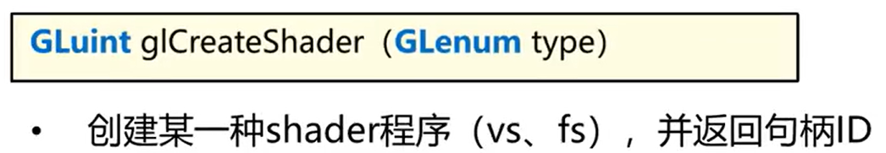


#### 给Shader注入源代码


#### 对Shader程序执行编译操作

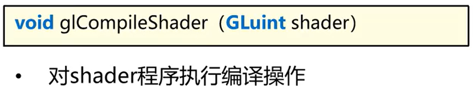


### Shader的链接

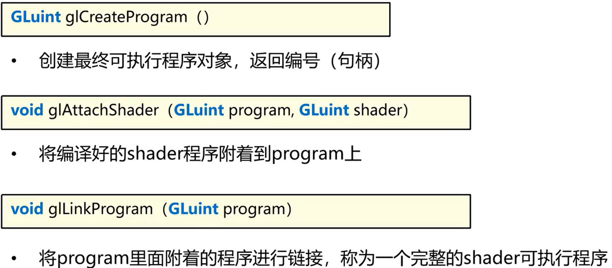


```c++
void prepareShader() {
    // 完成vs与fs的源代码，并且装入字符串
    const char* vertexShaderSource =
            "#version 460 core\n"
            "layout (location = 0) in vec3 aPos;\n"
            "void main()\n"
            "{\n"
            "   gl_Position = vec4(aPos.x, aPos.y, aPos.z, 1.0);\n"
            "}\0";

    const char* fragmentShaderSource =
            "#version 460 core\n"
            "out vec4 FragColor;\n"
            "void main()\n"
            "{\n"
            "   FragColor = vec4(1.0f, 0.5f, 0.2f, 1.0);\n"
            "}\0";

    // 创建Shader程序（vs、fs）
    GLuint vertex, fragment;
    vertex = glCreateShader(GL_VERTEX_SHADER);
    fragment = glCreateShader(GL_FRAGMENT_SHADER);

    // 为shader程序输入shader源代码
    glShaderSource(vertex, 1, &vertexShaderSource, nullptr);
    glShaderSource(fragment, 1, &fragmentShaderSource, nullptr);

    int success = 0;
    char infoLog[1024];
    // 执行shader代码编译
    glCompileShader(vertex);
    // 检查vertex编译结果
    glGetShaderiv(vertex, GL_COMPILE_STATUS, &success);
    if (!success) {
        glGetShaderInfoLog(vertex, 1024, nullptr, infoLog);
        std::cout << "Error: SHADER COMPILE ERROR --VERTEX" << "\n" << infoLog << std::endl;
    }

    glCompileShader(fragment);
    // 检查fragment编译结果
    glGetShaderiv(fragment, GL_COMPILE_STATUS, &success);
    if (!success) {
        glGetShaderInfoLog(fragment, 1024, nullptr, infoLog);
        std::cout << "Error: SHADER COMPILE ERROR --FRAGMENT" << "\n" << infoLog << std::endl;
    }

    // 创建一个Program的壳子
    GLuint program = 0;
    program = glCreateProgram();

    // 将vs与fs编译好的结果放到program这个壳子里
    glAttachShader(program, vertex);
    glAttachShader(program, fragment);

    // 执行program的链接操作，形成最终可执行shader程序
    glLinkProgram(program);

    // 检查链接错误
    glGetProgramiv(program, GL_LINK_STATUS, &success);
    if (!success) {
        glGetProgramInfoLog(program, 1024, nullptr, infoLog);
        std::cout << "Error: SHADER LINK ERROR" << "\n" << infoLog << std::endl;
    }

    // 清理
    glDeleteShader(vertex);
    glDeleteShader(fragment);
}
```


### 绘制流程

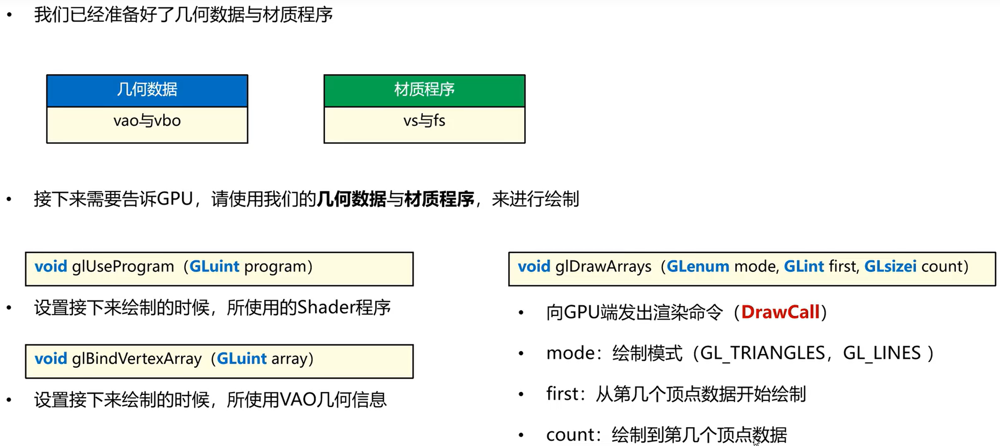

```c++
void render(GLuint program, GLuint vao) {
    // 执行opengl画布清理操作
    GL_CALL(glClear(GL_COLOR_BUFFER_BIT));

    // 绑定当前的program
    glUseProgram(program);

    // 绑定当前的vao
    glBindVertexArray(vao);

    // 发出绘制指令
    glDrawArrays(GL_TRIANGLES, 0, 5);
}
```


### 绘制模式

#### TRIANGLE

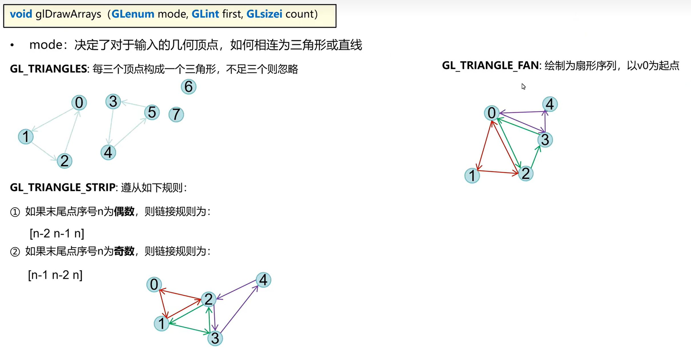

#### LINE

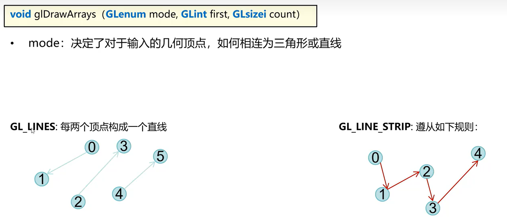


### 插值算法

利用多个顶点对新产生的像素的影响权重，计算新像素的属性值


#### 直线的线性插值算法

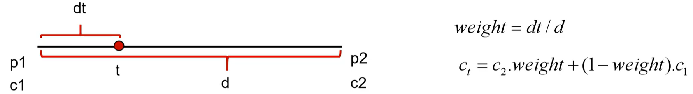


#### 三角形中信插值算法

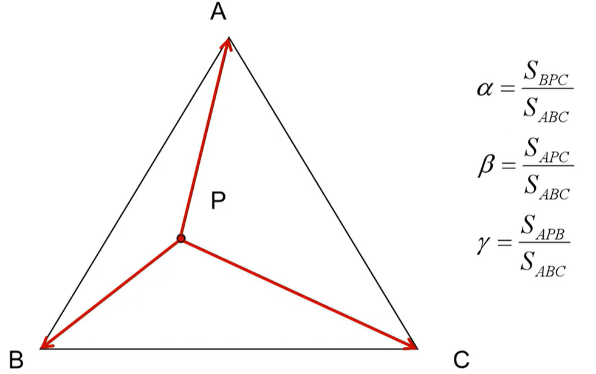

### 深度检测

**gl_FragCorrd​**：三维向量，XY当前绘制的Fragment(片元)在屏幕上的像素位置，Z记录了当前像素深度值(0-1)

深度检测的写入权限：希望当然绘制的Mesh参与深度检测，但是不要更新深度缓冲(绘制透明物体)


#### Z-Fighting

当两个面片相邻"过于接近"的时候，由于深度缓冲数据精度不足，会出现无法判断谁前谁后的问题

- 永远不要将多个物体摆设太近
- 使用glPolygonOffset对物体进行调配

#### PolygonOffset

多边形偏移，用于调整单个模型深度值的大小

- 当两个平面基本平行于镜头，只需要把其中一个的深度值+offset即可

  

#### 多边形偏移函数


#### PolygonOffset-倾斜导致


### 模板测试

**模板缓冲**：与深度缓冲相似(一张画布)，记录了当前绘制的物体覆盖了哪些像素区域。借助模板缓冲，可以知道哪些像素被绘制过，进而制订规则，只有通过本规则测试的像素才能绘制出来。


#### 模板测试API


### 颜色混合

颜色混合方式决定了当前颜色如何与颜色缓冲(画布)中的颜色进行调和，产生的新颜色会写入颜色缓冲

#### OpenGL颜色混合API


### 透明物体绘制策略

**核心思想**：尽可能让半透明物体"后面"的物体先绘制

**策略**：不透明物体先进行绘制；透明物体按照到摄像机的距离顺序，从后向前绘制。

#### 透明度蒙版

用一张黑白图，表示Mesh的透明度，黑色表示透明度为0，白色为1

### 面剔除(Face Culling)

正常的物体都是闭合的实体，将背对镜头的三角形进行剔除，从而提高性能

#### 面剔除-API


### 


## Element Buffer Object(EBO)

用于存储顶点绘制顺序索引号的GPU显存区域

顶点索引：用于描述一个三角形使用哪几个顶点数据的数字序列

### EBO的创建

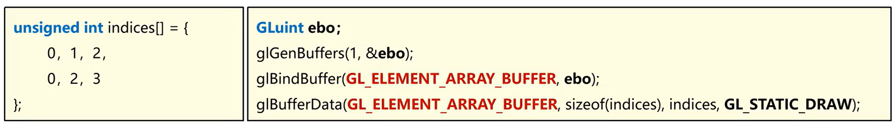

### EBO的绑定

ebo需要绑定在vao的描述当中

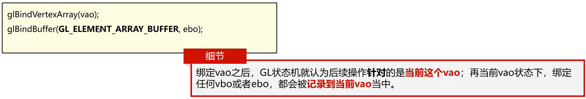

```c++
GLuint prepareVAO() {
    // 1.准备positions
    float positions[] = {
            -0.5f, -0.5f, 0.0f,
            0.5f, -0.5f, 0.0f,
            0.0f, 0.5f, 0.0f,
            0.5f, 0.5f, 0.0f
    };

    unsigned int indices[] = {
            0, 1, 2,
            2, 1, 3
    };

    // 2.VBO创建
    GLuint vbo;
    glGenBuffers(1, &vbo);
    glBindBuffer(GL_ARRAY_BUFFER, vbo);
    glBufferData(GL_ARRAY_BUFFER, sizeof(positions), positions, GL_STATIC_DRAW);

    // 3.EBO创建
    GLuint ebo;
    glGenBuffers(1, &ebo);
    glBindBuffer(GL_ELEMENT_ARRAY_BUFFER, ebo);
    glBufferData(GL_ELEMENT_ARRAY_BUFFER, sizeof(indices), indices, GL_STATIC_DRAW);

    // 4.VAO创建
    GLuint vao = 0;
    glGenVertexArrays(1, &vao);
    glBindVertexArray(vao);

    // 5.绑定vbo、ebo，加入属性描述信息
    // 加入位置属性描述信息
    glBindBuffer(GL_ARRAY_BUFFER, vbo);
    glEnableVertexAttribArray(0);
    glVertexAttribPointer(0, 3, GL_FLOAT, GL_FALSE, sizeof(float) * 3, (void*)0);

    // 加入ebo到当前的vao当中
    glBindBuffer(GL_ELEMENT_ARRAY_BUFFER, ebo);
    glBindVertexArray(0);

    return vao;
}
```


### 索引绘制函数

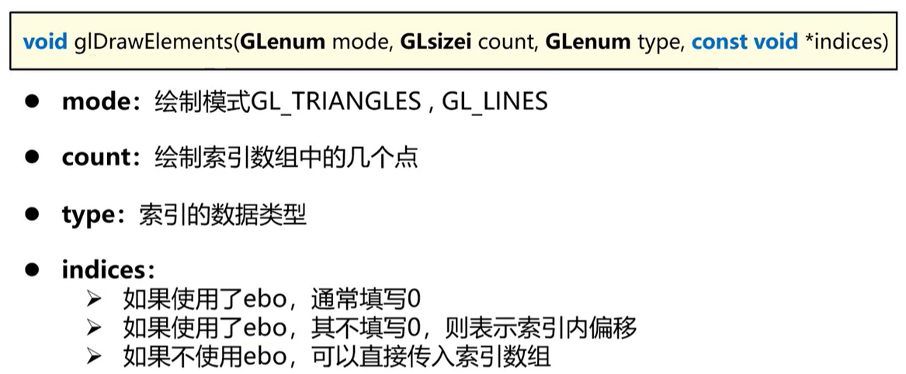

```c++
void render(GLuint program, GLuint vao) {
    // 执行opengl画布清理操作
    GL_CALL(glClear(GL_COLOR_BUFFER_BIT));

    // 绑定当前的program
    GL_CALL(glUseProgram(program));

    // 绑定当前的vao
    GL_CALL(glBindVertexArray(vao));

    // 发出绘制指令
    // GL_CALL(glDrawArrays(GL_TRIANGLES, 0, 4));
    
    // indices情况一
    GL_CALL(glDrawElements(GL_TRIANGLES, 6, GL_UNSIGNED_INT, (void*)0));
    
    
    /* indices情况二
    GL_CALL(glDrawElements(GL_TRIANGLES, 3, GL_UNSIGNED_INT, (void*)(sizeof(int)*3)));
    */
    
    /* indices情况三（只有未使用ebo的情况下才会生效）
    unsigned int indices[] = {
            0, 1, 2,
            2, 1, 3
    };
    GL_CALL(glDrawElements(GL_TRIANGLES, 6, GL_UNSIGNED_INT, indices));
    */
}
```


## 纹理与贴图(Texture)

### UV坐标

尝试将"像素对应"改为"比例对应"，复用一些图片像素。用于表达当前像素/顶点对应图片上百分比位置的横纵百分比，称为UV坐标。U为横向百分比，V为纵向百分比。

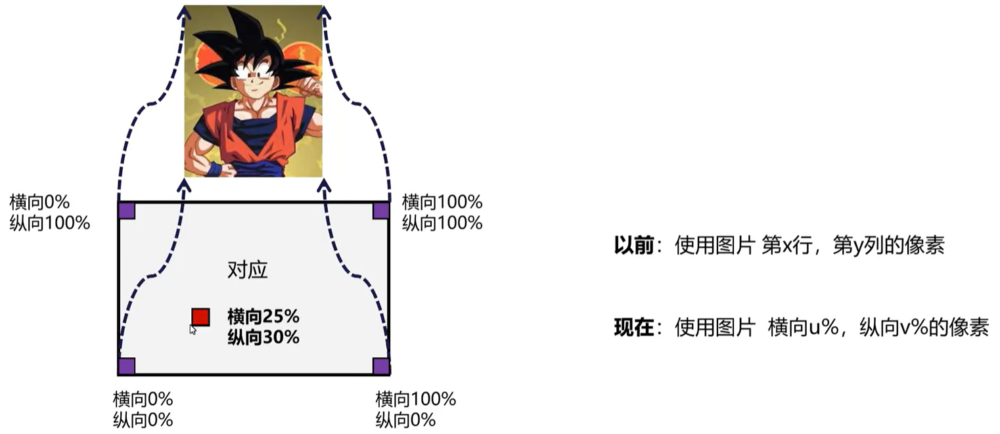


### 纹理与采样

#### 纹理对象

在GPU端，用来以一定格式存放纹理图片描述信息与数据信息的对象。

#### 采样器

在GPU端，用来根据uv坐标以一定算法从纹理内容中获取颜色的过程为采样，执行采样的对象为采样器。


### 读取图片

使用stb_image库

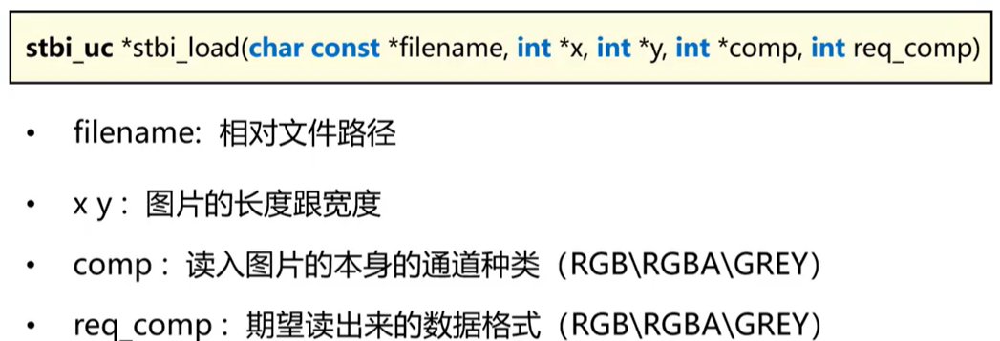


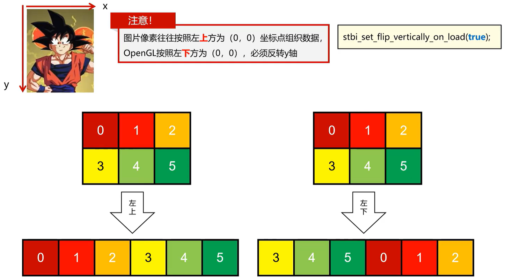


### 纹理单元(Texture Units)

用于链接采样器(Sampler)与纹理对象(Texture)，让Sampler知道去哪个纹理对象采样

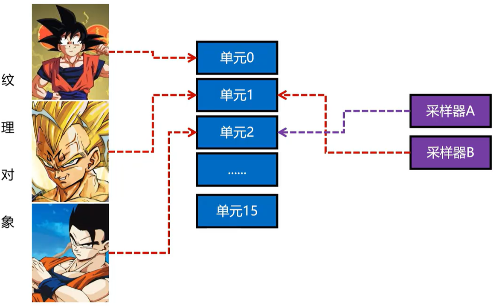


### 创建纹理对象

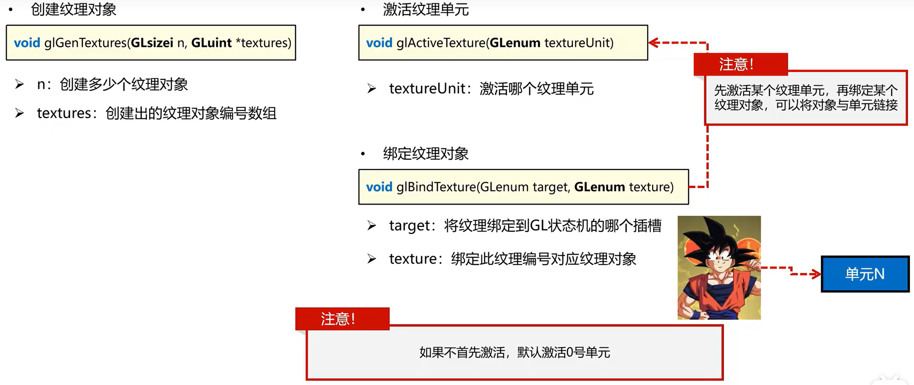

#### 开辟显存，传输数据

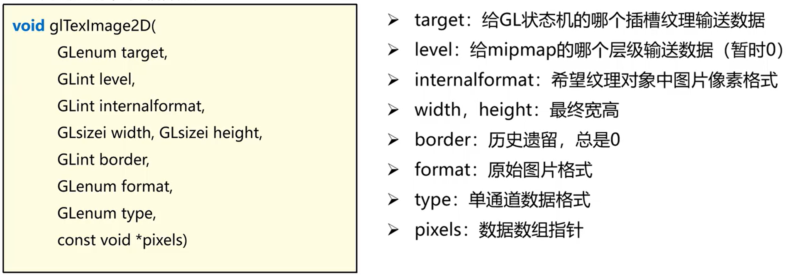


### 纹理过滤

```c++
// 4.设置纹理过滤方式
// 需要像素 > 图片像素：使用Linear
glTexParameteri(GL_TEXTURE_2D, GL_TEXTURE_MAG_FILTER, GL_LINEAR);
// 需要像素 < 图片像素：使用Nearest
glTexParameteri(GL_TEXTURE_2D, GL_TEXTURE_MIN_FILTER, GL_NEAREST);
```


### 纹理包裹(Wrapping)

当UV坐标超出0-1的范围时的纹理包裹方式

- Repeat：重复纹理。
- Mirrored：镜像纹理。
- ClampToEdge：边缘复用。
- ClampToBorder：设置边缘颜色，且复用。

对Wrapping的设置，可以分为u方向和v方向分别设置

```c++
// 4.设置纹理包裹方式
glTexParameteri(GL_TEXTURE_2D, GL_TEXTURE_WRAP_S, GL_REPEAT);
glTexParameteri(GL_TEXTURE_2D, GL_TEXTURE_WRAP_T, GL_MIRRORED_REPEAT);

// 1.要设置的对象是当前二级纹理
// 2.要设置纹理的哪个属性(u或者v的wrapping)
// 3.设置成哪个值
```


### 完整代码

```c++
void prepareTexture() {
    // 1.stb_image 读取图片
    int width, height, channels;

    // 反转y轴
    stbi_set_flip_vertically_on_load(true);

    unsigned char* data = stbi_load("assets/textures/goku.jpg", &width, &height, &channels, STBI_rgb_alpha);

    // 2.生成纹理并且激活单元绑定
    GLuint texture;
    glGenTextures(1, &texture);
    // 激活纹理单元
    glActiveTexture(GL_TEXTURE0);
    // 绑定纹理对象
    glBindTexture(GL_TEXTURE_2D, texture);

    // 3.传输纹理数据,开辟显存
    glTexImage2D(GL_TEXTURE_2D, 0, GL_RGBA, width, height, 0, GL_RGBA, GL_UNSIGNED_BYTE, data);

    // 释放数据
    stbi_image_free(data);

    // 4.设置纹理过滤方式
    glTexParameteri(GL_TEXTURE_2D, GL_TEXTURE_MAG_FILTER, GL_LINEAR);
    glTexParameteri(GL_TEXTURE_2D, GL_TEXTURE_MIN_FILTER, GL_NEAREST);

    // 4.设置纹理包裹方式
    glTexParameteri(GL_TEXTURE_2D, GL_TEXTURE_WRAP_S, GL_REPEAT);
    glTexParameteri(GL_TEXTURE_2D, GL_TEXTURE_WRAP_T, GL_MIRRORED_REPEAT);
}
```


## MipMap(多级渐远纹理)

问题：当物体距离镜头越来越远的时候，占用像素也会越来越少

-  贴图像素数量不变，造成信息浪费
- 只使用部分贴图信息，导致画面毛刺增多，表达错误
- 图片太大，物体太小，带宽浪费


### MipMap产生的原理

滤波+采样

- 滤波：对图片进行模糊预处理
- 采样：对模糊的图片，选取像素组成下一级mipmap


### 距离判定

纹素：纹理中的一个像素

如果能知道1个像素，对应m*n个纹素，log2(max(m,n))就可以当做mipmap的级别

通过glsl中的求偏导函数计算变化量决定


### 手动生成MipMap

```c++
for (int level = 0; true ; ++level) {
    // 1.将当前级别的mipmap对应的数据发往gpu端
    glTexImage2D(GL_TEXTURE_2D, level, GL_RGBA, width, height, 0, GL_RGBA, GL_UNSIGNED_BYTE, data);

    // 2.判断是否退出循环
    if (height == 1 && width == 1) {
        break;
    }

    // 3.计算下一次循环的宽度/高度，除以2
    width = width > 1 ? width / 2 : 1;
    height = height > 1 ? height / 2 : 1;
}

// 4.设置纹理过滤方式
glTexParameteri(GL_TEXTURE_2D, GL_TEXTURE_MAG_FILTER, GL_LINEAR);
glTexParameteri(GL_TEXTURE_2D, GL_TEXTURE_MIN_FILTER, GL_LINEAR_MIPMAP_LINEAR);
```


### 自动生成MipMap

```glsl
// 生成MipMap
glGenerateMipmap(GL_TEXTURE_2D);
// 设置MinFilter
glTexParameteri(GL_TEXTURE_2D, GL_TEXTURE_MIN_FILTER, GL_LINEAR_MIPMAP_NEAREST);
```


## 光照原理

环境光反射+漫反射+高光反射


### 漫反射

漫反射是指物体吸收了光能，将无法吸收的光向各个方向发射出去的反射过程

#### 漫反射光能吸收

物体对光能的吸收取决于物体接收到光照的面积


#### 漫反射光能释放

物体释放的光能与其本身颜色有关(颜色的本质就是吸收光能后释放出去的百分比)


#### 法线插值

像素发现插值：将法线作为顶点的属性数据之一，传入渲染管线，会被插值到每个片元像素。

### 高光反射

光源的直接反射，通常会在对象表面上显示为明亮的高光和反光。

高光反射的光斑强烈程度取决于观察方向与反射方向的夹角大小。

#### 高光反射计算方法


#### 视线方向计算

求取视线方向，需要知道 1.每个像素的世界坐标系位置；2.摄像机的世界坐标系位置。

每个像素的worldPosition，可以通过在vs里计算每个顶点的worldPosition，随后插值到每个像素上。


#### 法线矩阵

随着物体的旋转、平移、缩放，物体表面的法线该如何变换

$G$:法线变换矩阵

$M$:模型变换矩阵

$N$:法线向量

$T$:切线向量


#### 蒙版(Mask)

本质上是一张图片，使用本身固有像素来决定渲染的时候如何进行颜色的混合

##### 高光贴图蒙版(Specular Mask)

- 需求：希望物体上一部分区域显示高光，另一部分没有高光效果


##### 加入高光蒙版的步骤

- 材质类中，加入高光蒙版的Texture对象，并且将纹理单元设置为1
- FragmentShader中，增加specularMask纹理采样器，用作采样高光蒙版
- 在render函数中，每帧更新specularMask，传入采样单元为1
- FragmentShader中，根据uv对specularMask贴图进行采样，获取其R通道(GB也可以)，作为mask
- FragmentShader中，specular(高光系数)最终计算，需要乘上mask参数

### 点光源

点光源是从一个点发出的光线，所以光源的方向取决于：点光源位置+物体像素位置。

点光源具有位置属性，所以光能会按照到光源的距离进行衰减。

#### 光能衰减(Lighting Attenuation)

点光源的照射会形成一个球面，向外扩散


光源如果直接采用距离二次方，测衰减速度过快，可调的参量太少。

### 聚光灯

聚光灯在一个特定角度内，可以保持对场景的照亮；在角度外，光能会变为0


#### 聚光灯边缘模糊

让超出光照范围的区域呈现光能逐步递减的样子


## 代码架构设计


### 渲染器设计

渲染器是一个解封装的过程，拿出每一个Mesh的零件，分析应该如何渲染


### 材质设计

材质描述了物体表面如何与光发生反应。Phong光照模型

#### 材质参数

物体的漫反射颜色(Diffuse Color)可以代表本身的固有色

- 物体本身固有色可以用两种方式表示
  - 物体顶点颜色+插值
  - 使用像素uv采样贴图

物体的高光反射性质

- 光斑大小调整(Shines)

物体的环境反射颜色

- 大多数情况设置为物体贴图颜色

#### 材质类设计

父类设计为Material，包含一个参数即类型

Phong材质是其中一个子类

### 场景

游戏中所有物体组成的集合，称为场景

场景中存在两种物体：Mesh与空物体(Object)


#### 基于场景(Scene)的渲染流程

场景的渲染是一个递归的过程


## 帧缓冲

### 帧缓冲需求分析

当绘制完一帧后，会得到一张图片进行显示；如果想对当前的图片进行一次全屏的模糊，就无法做到了。因为无法获取到当前像素周边像素的颜色值。

**解决办法**：先把当前帧绘制到另一张画布上(不用于显示)，然后使用这张画布做纹理输入，再次进行绘制。

GLFW+OpenGL在程序初始化的时候，就提供了一张用于渲染到屏幕上的画布

- 帧缓冲(FrameBuffer)：在绘制一帧图像的时候，用于记录绘制颜色、深度、模板值等当前帧数据的一套缓存总和。
- 附件(Attachment)：组成一个帧缓冲中，颜色缓存、深度缓存、模板缓存，统称为帧缓冲的附件

### 帧缓冲-API


### 颜色附件创建(ColorAttachment)

颜色附件，本质上来讲就是一个长宽与窗体大小相等的Texture纹理图片


### 深度与模板附件创建(DepthStencilAttachment)

深度与模板缓存，一般情况下可以分配在同一个缓存中；每个像素对应32个bit的话，深度缓存用掉24bit，模板缓存用8bit


## 立方体贴图(CubeMap)

一个立方体贴图对象包括了六个图片，像一个盒子一样。包裹住摄像机

**采样执行方式**：使用1x1x1的立方体，每个像素的相机坐标系的位置作为采样的向量

## 球形投影贴图(SphericalMap)

可以理解为把一个球形的外皮扒下来，展开成一张2D图片


